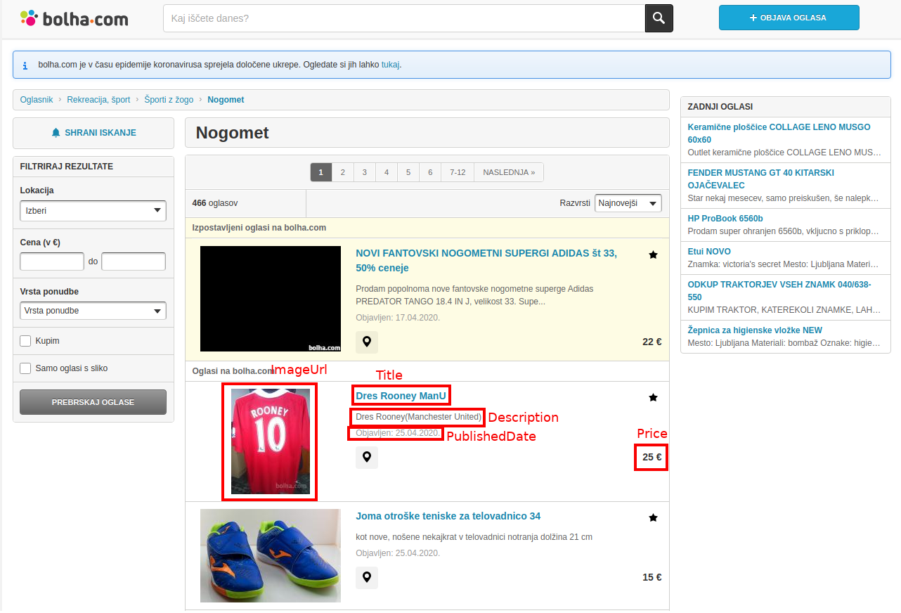

# IEPS

Libraries used:
- [lxml](https://pypi.org/project/lxml/)
- [beautifulsoup4](https://pypi.org/project/beautifulsoup4/)

## Assignment 2
[Instructions](https://szitnik.github.io/wier-labs/PA2.html)

The goal of this programming assignment is to implement three  different
 approaches for the structured data extraction from the Web:
- Using regular expressions
- Using XPath
- RoadRunner-like implementation

### Additional websites
[Bolha.com](https://www.bolha.com/nogomet)

#### Extracted data
- Title
- Description
- Price
- PublishedDate
- ImageUrl

